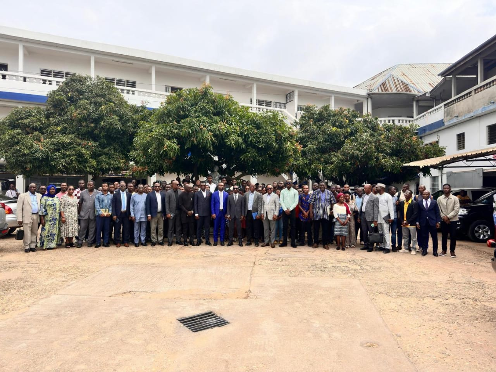
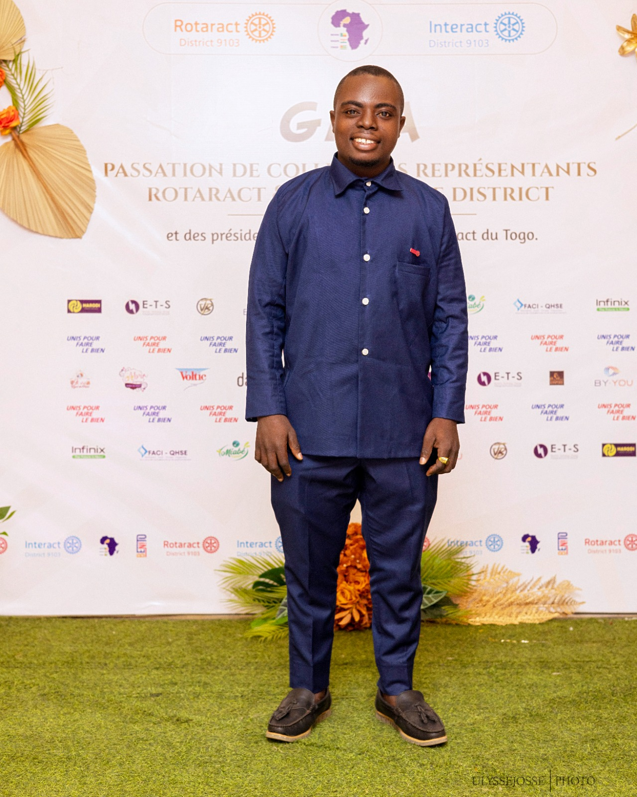

# **JOURNAL DU 24 AOUT 2026**

## résumé du jour**
# *PREMIERE PARTIE DE LA JOURNE*
-CEREMONIE DE LANCEMENT OFFICIEL DE LA FORMATION DES FABMANAGERS

> Les fabnagers sont arrivés apres l'installation de la salle de formation et tout ça à commencer à 7h00 et à sa suite l'installation des ivités 

-**mots de bienvenue du directeur de l'INFPP**
-discours du responsable du FNAFPP

-et pour finir cette phase le ministre de l'éducation nation son excellence M. MAMA Omourou

-à la suite les autorités ont procédé à la visite du local 

-après la photo de famille on est allé à la pause 

-juste apres la pause nous avions procedé à la distribution des ordinateurs portables aux paticipants qui en n'ont pas

- après s'est dééroulé le module : Documenter avec Git, GitHub, et GitHub Pages

- pour finir nous avions procéder à un exercice pratique avait pour but la maitrise du plan de travail avec le logiciel Git CMD. 

ANNEX

**photo du raporteur**
