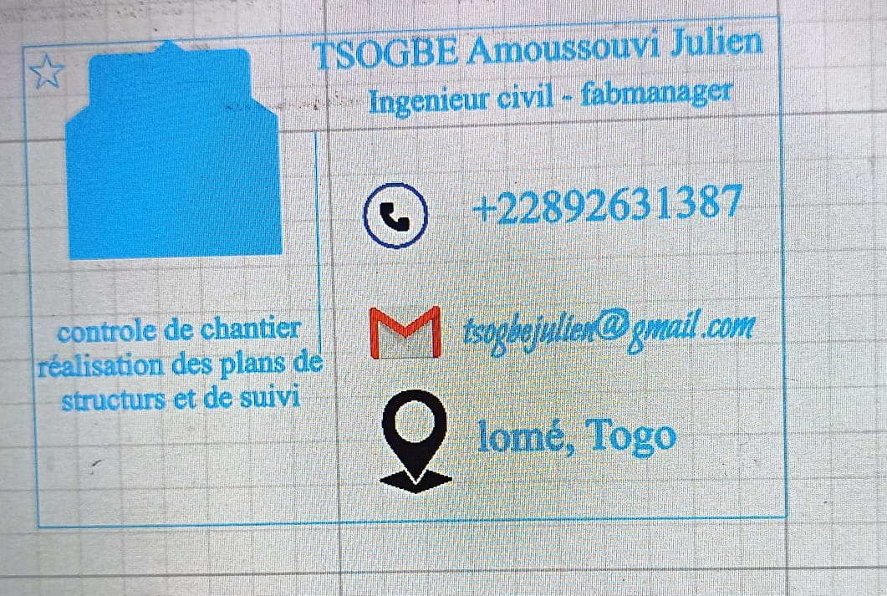
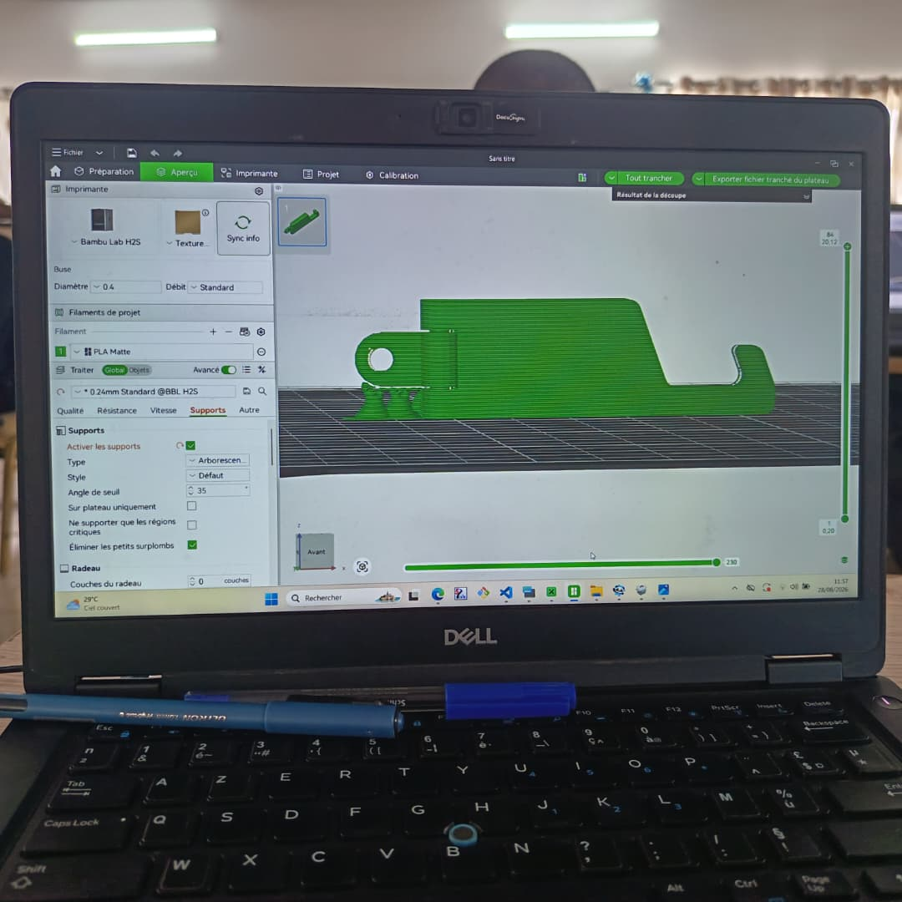

# **JOURNAL DU 27 AOUT 2026**

## Fait aujourd'hui

- Control de présence

## Appris

### section 1 : Atelier de projet

-le foermateur est absent

### section 2 : Atelier de decoupe laser
1. Realisation de notre carte de visite dans XTool Studio
- **Exemple de carte de visite*

2. Impression au Laser avec des paramètre bien precis
- pour couper: 
> puissance 90

> vitesse 50
- pour graver: 
> puissance 20

> vitesse 600
### **Pause dejeuné de 12h30 a 13h30**

### section 3 : Les bases de l'electronique dans les Fablabs
1. Copie du fichier d'installation : mBlock
2. Installation de mBlock
3. Impression d'un Cube en 3D
- Apérçu de l'environnement de travail

### section 4 : Impression 3D et la modelisation
1. Copie du fichier d'installation et d'impression 3D : Bambu Lab
2. Installation de Bambu Lab et paramétrage
3. Impression d'un Cube en 3D apres importation
- Apérçu de l'environnement de travail

> *et fin de la journée!*