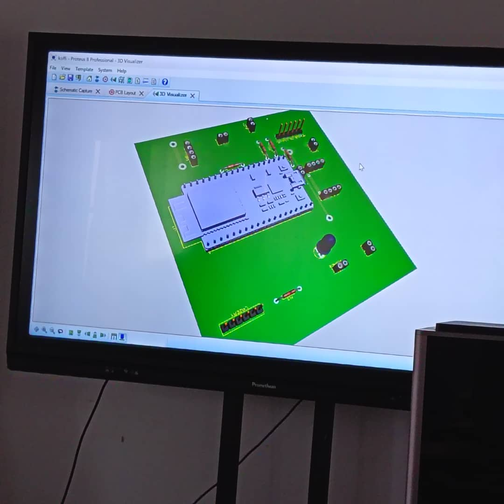

# JOURNAL DU 04 SEMPTEMBRE 2026

La journée s'est débutée par le partage des pc et leurs chargeur
- présentation du programme et repartition des groupes 

## SEANCE 1: SALLE DE L'IMPRESSION 3D

#### *MODELISATION D'UNE PIECE EN 3D AVEC LE LOGICIEL FUSION

ATELIER 2: salle de découpe lazer

## -fabrication des PCB

-PCB: c'est la plaquette avec circuit déssiner dessus sans les composants 

- les constituants d'un PCB

## SEANCE 3: PROGRAMMATION AVEC PYTON
## *Initiation au langage python avec pris en main sur Thonny*

- Exercice de programme à écrire

- Agencement de notre projet

> Comment programmer dans python.Les types de données de bases comme int,str,float,bool
les types composés et les régles de bases.

## Raté, puis corrigé

- [Programme de réservation de place dans python] 

 - je ne connais pas encore les types de donner et de composants avec leur fonctionnalités. 
 
 - Affection une fontion de chaîne de caractères a un nombre entier 
 
 moditifier les entrées voir ce qui marche
 
 un textprogramme de réservation correcte

fin de la journnée 