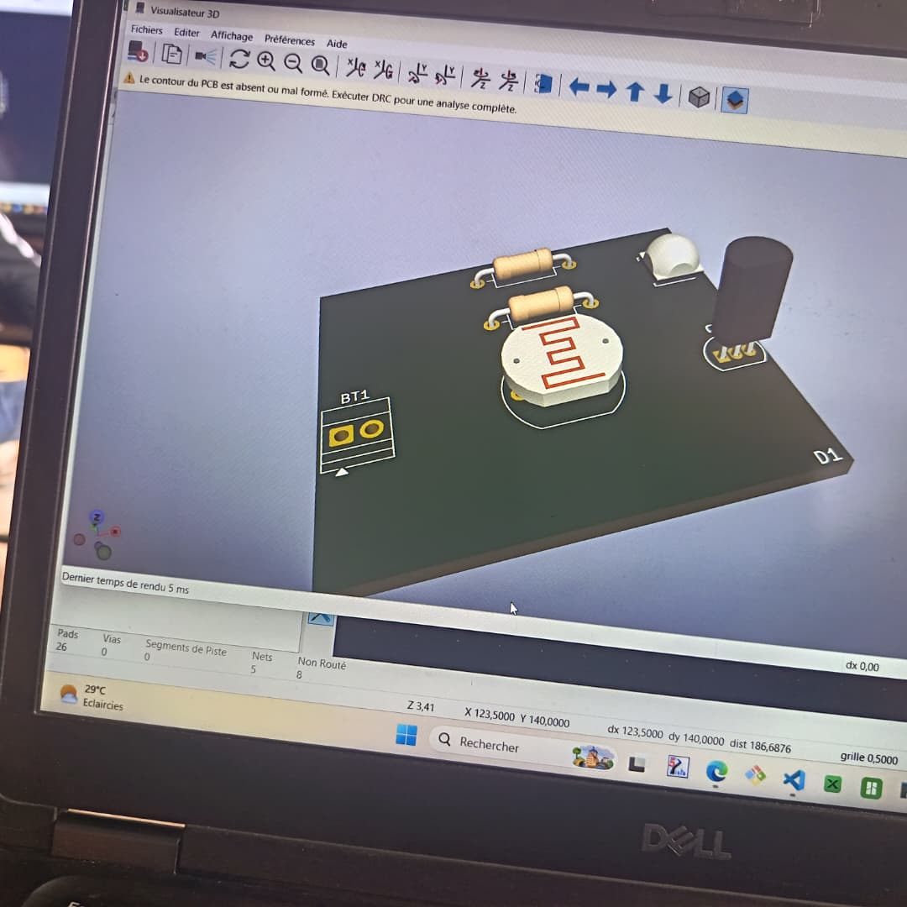

# JOURNAL DU 07 SEMPTEMBRE 2026

## SEANCE 1 (Découverte et conception d'un PCB)

- *La journée a été principalement consacrée à un atelier d'électronique portant sur le PCB (Printed Circuit Board), ou circuit imprimé, afin de mieux nous préparer à concevoir la partie électronique de nos différents projets*.

- Nous avons d'abord étudié le rôle du PCB. Il sert à supporter, connecter et organiser les composants électroniques d'un circuit. Les connexions électriques sont réalisées grâce aux pistes en cuivre. Les circuits imprimés sont notamment présents dans les cartes électroniques et dans de nombreux appareils électroniques.

> #### Enfin, nous avons utilisé la visualisation 3D de KiCad afin d'observer le rendu de la carte et de mieux comprendre à quoi pourrait ressembler le PCB une fois réalisé.

> #### *Cette pratique nous a permis d'apprendre les premières étapes de conception d'un PCB : placer les composants, les déplacer, réaliser les liaisons entre eux et vérifier le résultat obtenu*.

**ainsi prend fin la journée**!