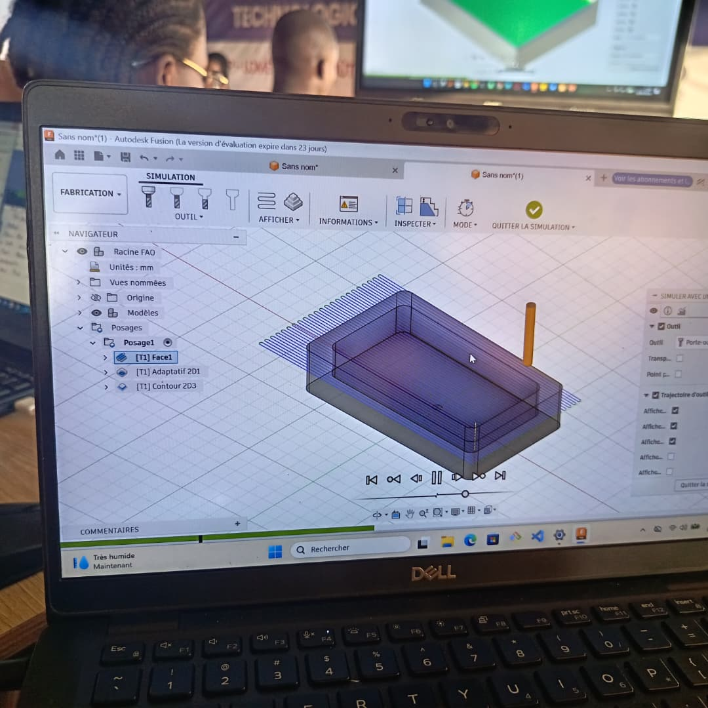

# JOURNAL DU 08 SEMPTEMBRE 2026

après le partage des 

## SEANCE 1: SALLE DE DECOUPE LAZER

- nous avions eu à parler de nos projet,  

- faire une simulation de nos composants sur le site en ligne WOKWI.

## SEANCE 2: GRANDE SALLE/ DE LA CONCEPTION A LA PIECE USINEE AVEC LE LOGICEL FUSION 360

-La séance a porté sur la abrication assistée par ordinateur (FAO/CAM) et sur le processus permettant de passer de la conception numérique à la fabrication d'une pièce sur une machine CNC.

### *Les principaux points abordés sont* :

> Qu'est-ce que la FAO (CAM) ?

>Les machines CNC : de quoi parle-t-on ?

> **Fusion 360** comme environnement intégré regroupant notamment la conception (*Design*) et la fabrication (*Manufacturing*).

>Les différentes stratégies d'usinage :

> ébauche ;

>finition.

#### *Les principaux paramètres de coupe* :

- vitesse de coupe ;
- vitesse d'avance ;
-profondeur de passe ;
- engagement radial.
- La **simulation d'usinage**, permettant de vérifier les opérations avant de lancer l'usinage réel.
- Le **post-traitement**, qui permet de générer le fichier **G-code** adapté à la machine CNC.
- L'intérêt de la FAO dans Fusion 360 pour préparer, simuler et contrôler les opérations d'usinage.

#### Les bonnes pratiques à retenir :

-  toujours simuler avant l'usinage réel ;
- adapter les paramètres d'usinage au matériau et à l'outil ;
-  vérifier les dimensions et les trajectoires avant l'usinage.

##### *ainsi la journée prend fin!*